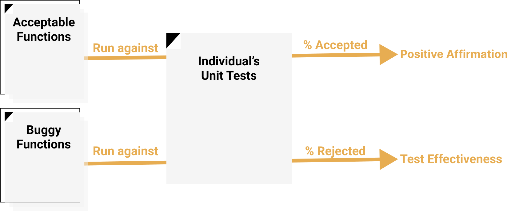
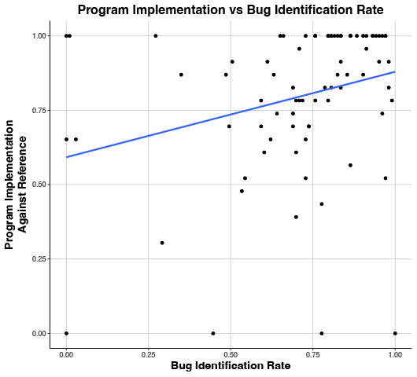
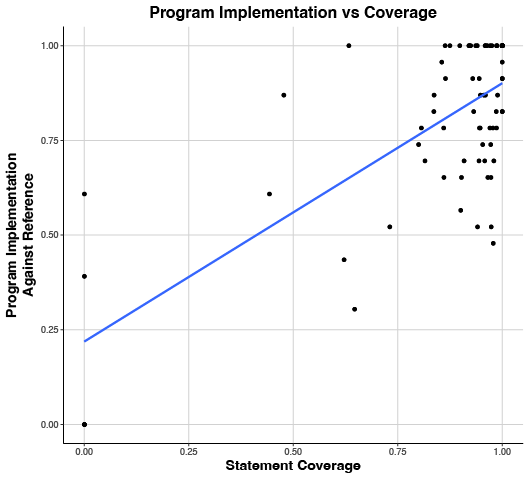
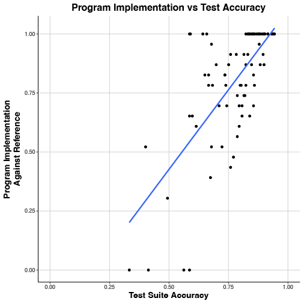
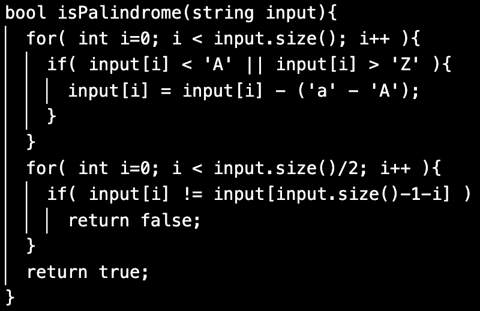

[comment]: # (Compile this presentation with the command below)
[comment]: # (mdslides index.md && mv index/index.html .)
[comment]: # (THEME = night)
[comment]: # (CODE_THEME = base16/zenburn)
[comment]: # (The list of themes is at https://revealjs.com/themes/)
[comment]: # (The list of code themes is at https://highlightjs.org/)
[comment]: # (Pass optional settings to reveal.js:)
[comment]: # (controls: true)
[comment]: # (keyboard: true)
[comment]: # (progress: true)
[comment]: # (width: "1024")
[comment]: # (markdown: { smartypants: true })
[comment]: # (hash: false)
[comment]: # (respondToHashChanges: false)
[comment]: # (Other settings are documented at https://revealjs.com/config/)

### Preparing Future Software Engineers
----------

Kevin Buffardi, Ph.D., Professor, California State University, Chico

[LearnByFailure.com](https://learnbyfailure.com/)


</img>

<sub>[LearnByFailure.com](https://learnbyfailure.com/future-software-engineers/)</sub>

[comment]: # (!!!)

#### Challenges: Academia to Industry

- **Learning to learn**
- **Navigate "Big Picture" of Software Engineering**
- **Critial Thinking**

[comment]: # (||| data-auto-animate)

#### Challenges: Academia to Industry

- **Learning to learn**
  - Contemporary technologies
    - DevOps (Docker, GitHub Actions CI, etc.)
    - Leading tech stacks
  - Adapting to evolving trends
  - Professional skills
    - Communication, collaboration, leadership
    - Entrepreneurship

[comment]: # (||| data-auto-animate)

#### Challenges: Academia to Industry

- **Navigate "Big Picture" of Software Engineering**
  - Prioritizing users' evolving needs
    - Involve clients and/or stakeholders when possible
  - Long-term maintenance and implications
    - Projects with legacy code

[comment]: # (||| data-auto-animate)

#### Challenges: Academia to Industry

- **Critial Thinking**
  - Learning, analyzing, innovating norms
  - Testing yourself


[comment]: # (!!! data-auto-animate)

#### Testing Yourself: Unit testing

* Automated check of the functionality of the smallest "unit" of code
  * Documents expected behavior of the unit
* Sooner we discover bugs, the better
  * Test a function implementation immediately
  * Regression tests

[comment]: # (|||)

#### Testing Yourself: Unit Test Assertiona

Compare **actual** and **expected** values 
of placing pieces on a Tic-Tac-Toe board:

`ASSERT_EQ( board.place_piece(0,0), 'X');`

Or 

`ASSERT_EQ( board.place_piece(-1,2), '?');`


[comment]: # (|||)

#### Limitations of Testing Metrics

* **Coverage** - After all tests are run, what % of production code has been run?

[comment]: # (||| data-auto-animate)

#### Limitations of Testing Metrics

* **Coverage** - After all tests are run, what % of production code has been run?
* **Mutation Testing** - Make "mutant" variants of code, are they "killed" by tests?

[comment]: # (||| data-auto-animate)

#### Mutants

``` [1|2|3|4]
if( row >= 0 && row <= 2 && column >= 0 && column <= 2 )
if( row >= 0 && row <= 2 && column > 0 && column <= 2 )
if( row >= 0 && row <= 2 && column >= 0 )
if( row >= 0 && row <= 2 || column >= 0 && column <= 2 )
```
  
[comment]: # (|||)

#### What about...

`ASSERT_EQ( true, false );`

[comment]: # (!!!)

#### Testing Yourself: Positive Affirmation

* How reliably do tests **positively affirm** functionality consistent with software requirements?
* All-Function Pairs testing
  1. Classify each student's code (against instructor's tests) as **acceptable** or **buggy**
  2. Run each student's tests against each {acceptable, buggy} implementation

[comment]: # (|||)



[comment]: # (|||)

* Many do well (but not perfect) with only a few false positives and negatives
* Some struggled with either:
  * **positive affirmation** *or* **test effectiveness** on a given function to test
* Either type of inaccuracy is *equally associated* with number of bugs in *their own* code [(Buffardi \& Valdivia, 2019)](http://hdl.handle.net/10125/60199)
* Some "Unit Test Smells" associated with **worse accuracy** [(Buffardi \& Aguirre-Ayala, 2021)](https://dl.acm.org/doi/abs/10.1145/3430665.3456328)

[comment]: # (!!!)

#### Testing Yourself: Measuring Testing Accuracy

* How are **testing effectiveness** and **positive affirmation** related to a lack of bugs? [(Buffardi, Valdivia, \& Rogers, 2019)](https://doi.org/10.1145/3287324.3287351)
  * **Accuracy** = (True Positives + True Negatives) / 
    (True Positives + True Negatives + False Positives + False Negatives)
  * **Accuracy** stronger correlation with lack of bugs than either **Test Effectiveness** or **Coverage**

[comment]: # (|||)



(ρ=.355, p<.0167)

[comment]: # (|||)



(ρ=.514, p<.001)

[comment]: # (|||)



(ρ=.648, p<.001)

[comment]: # (!!!)

#### Reflecting like a tester

  * Tversky and Kahneman’s [*Nobel Prize in Economics-winning research*](https://www.nobelprize.org/prizes/economic-sciences/2002/kahneman/facts/): consumers do not make decisions in their rational best interests because of cognitive biases
  * [**Cognitive Reflection Test**](https://www.aeaweb.org/articles?id=10.1257/089533005775196732) (CRT) tests the proficiency at inhibiting (fast) *"gut reaction"* in favor of (slower) *deliberate critical thinking*, e.g.:

A bat and a ball cost `$1.10` in total. The bat costs `$1.00` more than the ball. How much does the ball cost?

[comment]: # (!!!)

##### Code Review

* <small>Receive a string and return whether or not it is strictly a palindrome, where it is spelled the same backwards and forwards when considering every character in the string, but disregarding case ('x' is same as 'X')</small>



[comment]: # (!!!)

#### CRT vs Code Review

* CRT was a significant predictor of:
  * Code review **rejecting defective code** (p<0.0001) with the log odds of correctly rejecting the defective code increasing by 2.94 (95% CI 1.56-4.50)
  * Code review **identifying a defective case** (p<0.001) with the log odds of doing so increasing by 2.37 (95% CI 1.05-3.86).

[comment]: # (||| data-auto-animate)

#### CRT vs Code Review

* CRT is strongly associated with **numeracy**
* Replication study: variant of CRT (with no math) and different functions
  * consistent association with **manual code review** (ρ=0.478, p<0.01)

[comment]: # (|||)

#### CRT vs Unit Testing

* **However**, no correlation between CRT and unit test accuracy in either original (ρ=0.008, p=0.940) or replication (ρ=0.113, p=0.498) studies [(Buffardi 2023)](https://doi.org/10.1109/ICSE-SEET58685.2023.00006)
* *Why do you think cognitive reflection is associated with manually reviewing code, but not unit test accuracy?*

[comment]: # (!!!)

#### Preparing Future Software Engineers

<small>This presentation is accessible at [learnbyfailure.com/future-software-engineers/](https://learnbyfailure.com/future-software-engineers/) and its source is available on [GitHub](https://github.com/kbuffardi/future-software-engineers/).</small>

<small>Special thanks to student co-authors: [Pedro Valdivia](https://www.linkedin.com/in/pedro-valdivia1/), [Destiny Rogers](https://www.linkedin.com/in/destiny-rogers/), and [Juan Aguirre-Ayala](https://www.linkedin.com/in/jaguirre-ayala/) who were all undergraduate researchers at Chico State.</small>


</img>

<small>[Back to LearnByFailure](https://learnbyfailure.com/research/)
</small>
